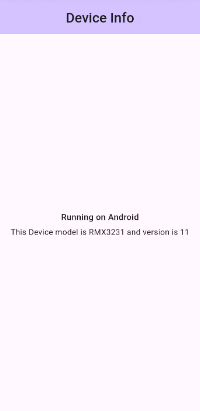

# Device_Info_App

# General Description

This is a simple application that shows some info about the device.

The app determines the current operating system, device model and version:

- Determine the current platform using dart:io library.
- Determine the device model name and its operating system version using device_info_plus library.

The home screen body contains a column of two text in center alignment:
The first one is the current operating system text, the second one is the device model and version.

----------------------
# Screenshots
 

----------------------------

# Packages Used

device_info_plus: => https://pub.dev/packages/device_info_plus

----------------------------------------
# Notes:                     
-  **The media access task --> in media-access-feature branch**.                          
-  **The google maps task --> in google-maps-feature branch**
